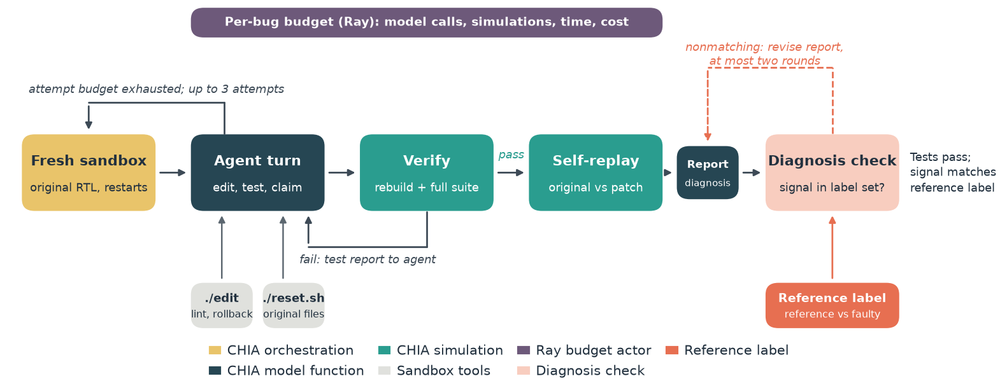
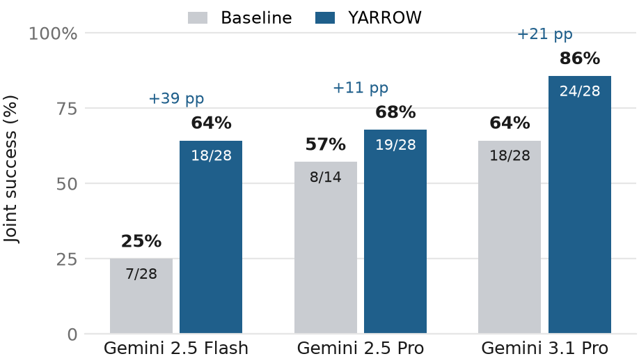
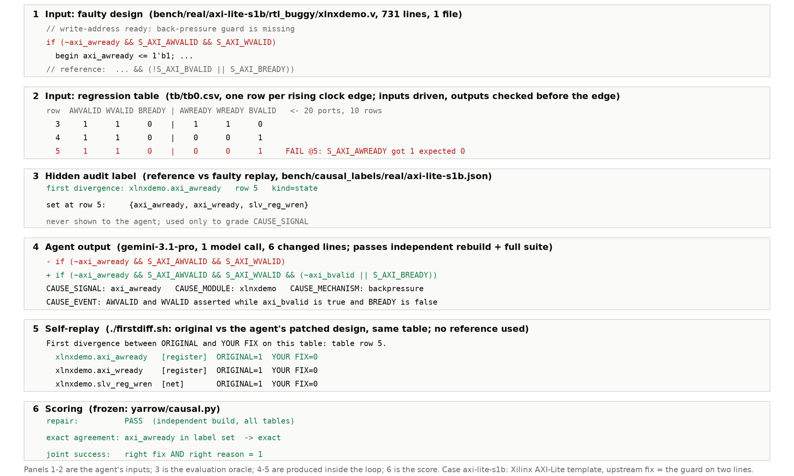

# YARROW: Right Fix, Wrong Reason

*Yet Another RTL Root-cause Oracle Workflow.* A [CHIA](https://github.com/ucb-bar/chia)
debugging loop that verifies an RTL patch independently and checks the agent's
diagnosis against a simulation-derived first-divergence label.
Built for the A³ Workshop CHIA hackathon, MICRO 2026.

## Quick start

```bash
git clone https://github.com/snarang181/yarrow && cd yarrow
scripts/quickstart.sh setup     # clones CHIA, creates .venv, installs deps (needs uv, Verilator 5.x)
scripts/quickstart.sh check     # reference passes, every benchmark bug is caught
scripts/quickstart.sh demo      # one field bug end to end, offline: sandbox, lint-gated edit,
                                #   reference fix, self-replay, and the hidden label it should match
scripts/quickstart.sh run       # the full YARROW loop on that bug with Gemini (needs gcloud ADC)
```

The demo needs no model credentials and takes about a minute. It builds the
sandbox for `axi-lite-s1b`, shows the failing table row, shows an edit that
breaks compilation being rolled back, applies the reference fix, runs
self-replay, and prints the first-divergence label the diagnosis check uses.
Set `BUG=<case>` or `MODEL=<gemini model>` to change the target.

## Summary

An RTL repair can pass its tests while the accompanying diagnosis misidentifies
where the failure first appears. Across three Gemini models and 82 bugs, Gemini
3.1 Pro repairs every field bug but names the labeled signal in only 64% of
those repairs. YARROW closes the gap with a loop that (1) searches for a patch
under budget-split restarts with a lint-gated edit tool, (2) verifies the patch
by an independent rebuild and full test suite, (3) has the agent replay its own
patch against the original design to read off the first differing signal, and
(4) checks that claim against a reference-derived label with bounded feedback.
On 14 bugs from open-source hardware projects, joint success (passing patch
*and* matching diagnosis) rises from 25% to 64% for Gemini 2.5 Flash, 57% to
68% for Gemini 2.5 Pro, and 64% to 86% for Gemini 3.1 Pro.

## Problem statement

A debugging agent edits a design, runs the testbench, and iterates until the
tests pass. Those tests never check the explanation the agent hands back. An
engineer reviewing the patch needs both what changed and why the change fixes
the failure, and a wrong "why" survives a green test run.

Hardware allows a mechanical check. Given a faulty design and a compatible
reference, running both under identical stimulus and comparing every internal
signal yields the earliest tick at which values differ and the set of signals
that differ there. Whether the agent's claimed signal belongs to that set is a
reproducible measurement that needs no language model as a judge. It is a
localization target for one execution, not a proof of a unique root cause.

The question is then twofold: how often do passing repairs come with a
nonmatching diagnosis, and what loop structure raises the rate at which an agent
delivers both a passing patch and a matching diagnosis.

## The CHIA loop



1. **Fresh sandbox.** The original sources, the regression tables, and the
   tools. Each bug's budget (model calls, simulations, wall clock) is split
   across three independent repair attempts; a new repair attempt starts from the original
   design with no memory of the previous one.
2. **Agent turn.** One tool-using turn on a Gemini model through CHIA's
   `BashTool`. The agent can run the suite, simulate one table, query
   waveforms, edit through a lint-gated command that rolls back any change that
   breaks compilation, and reset to the original sources. It returns a patch
   and a `CAUSE_SIGNAL / CAUSE_MODULE / CAUSE_EVENT / CAUSE_MECHANISM` claim.
3. **Verify.** A separate function rebuilds the submitted sources and runs the
   full suite. Failure returns the test report to the agent.
4. **Self-replay.** After a pass, `./firstdiff.sh` simulates the original and
   the patched design on the same table and prints the first internal signal
   whose value differs. The agent takes its claimed signal from this output.
   No reference is consulted.
5. **Claim check.** The claimed signal is compared with the precomputed
   reference label. A mismatch returns "your claim is wrong, re-examine" for
   at most two rounds. A patch is accepted when both checks pass.

## How we use CHIA

Every stage is a `@ChiaFunction` or a Ray actor with declared resources, so the
pieces compose into other loops without the rest of YARROW.

| Block | Where | Resource | Role |
|---|---|---|---|
| `ops.build_and_test` | `yarrow/ops.py` | `sim` | rebuild RTL text (single file or `design.json` multi-file) and run named suite configs |
| `ops.make_sandbox` | `yarrow/ops.py` | – | agent sandbox with metered `test.sh`/`sim.sh`/`probe.sh`; `hygiene=True` adds `./edit`, `./reset.sh`, `./firstdiff.sh` |
| `budget.BudgetActor` | `yarrow/budget.py` | Ray actor | hard ceilings on calls, simulations, wall clock; per-turn cost ledger |
| `agent.agent_turn` | `yarrow/agent.py` | `llm` | one tool-using turn on any `chia.models` adapter (Vertex Gemini, OpenAI-compatible, Claude Code) |
| `loop.flat_solve` | `yarrow/loop.py` | `orch` | propose, independent verify, feedback; post-repair claim check with Feedback A/B |
| restarts | `yarrow/driver.py` | – | N fresh repair attempts per bug with 1/N budgets; first verified patch wins |
| `causal.claim_exact` | `yarrow/causal.py` | – | frozen scorer: claimed signal versus first-divergence label set |
| `scripts/first_divergence.py` | – | – | streaming two-trace first divergence, used by `./firstdiff.sh` and by the label pipeline rules |
| `scripts/gen_table_tb.py`, `scripts/import_rtlrepair.py` | – | – | turn a design plus a recorded cycle table into a Verilator table testbench and a `design.json` case |

CHIA supplies the scheduling (`sim` 4 slots, `llm` 2, `orch` shared on one
16-core machine, seven cells concurrently), the model adapters with per-turn
token and cost accounting, and per-bug resumption. A new design needs only a
`design.json` (sources, top module, tables); the loop, scorer, budget actor,
and adapters are untouched.

**Setup and run**

```bash
git clone https://github.com/ucb-bar/chia && uv venv .venv --python 3.12 --seed
uv pip install -e ./chia openai matplotlib        # Verilator 5.x and gcloud ADC for Vertex
.venv/bin/python scripts/validate_bench.py        # synthetic tier: reference passes, all mutants killed
.venv/bin/python scripts/validate_real.py         # field tier: 14/14
.venv/bin/python scripts/gen_real_labels.py       # first-divergence labels

# baseline                                        # add --cause-loop A  -> post-repair check
.venv/bin/python -m yarrow.driver --mutants all --backend gemini --model gemini-2.5-flash \
  --mutants-dir bench/real --llm-budget 20 --sim-budget 160 --wall-budget 2700 --cause-footer \
  --out-dir runs/flash_real_r1
# YARROW: add --restarts 3 --tight --cause-loop A

.venv/bin/python scripts/make_tables.py           # results/causal_tables.txt from results/*.summaries.json
```

Runs resume per bug. `results/` holds one `summaries.json` per reported cell;
full transcripts for every cell are available from the authors on request.

```
bench/mutants*/   44 synthetic mutants     bench/real/    14 field bugs, 11 designs
bench/cirfix/     24 CirFix cases          bench/causal_labels/   labels per tier
yarrow/           the loop                 scripts/       labels, gates, testbench generator, scorer, reports
results/          measurement cells        figures/       README figures
```

## Results

All measurements are Gemini on Vertex AI. Percentages should be read with
their denominators.

**Baseline workflow: repair rate and exact agreement among repairs (%).** X: 24 CirFix cases;
S: 29 single-fault and 15 composed cache-controller mutants; R: 14 field bugs.

| Gemini | X repair | X agree | S single repair | S single agree | S composed repair | S composed agree | R repair | R agree |
|---|---|---|---|---|---|---|---|---|
| 2.5 Flash | 100 | 79 | 93 | 74 | 77 | 48 | 50 | 50 |
| 2.5 Pro | 100 | 96 | 97 | 82 | 93 | 64 | 64 | 89 |
| 3.1 Pro | 100 | 100 | 100 | 78 | 100 | 80 | 100 | 64 |

**Field tier: repair rate, joint success (%), and scored evaluations n.** Joint success requires a passing
patch and a matching claim.

| Workflow | Flash repair | Flash joint | n | 2.5 Pro repair | 2.5 Pro joint | n | 3.1 Pro repair | 3.1 Pro joint | n |
|---|---|---|---|---|---|---|---|---|---|
| Baseline | 50 | 25 | 28 | 64 | 57 | 14 | 100 | 64 | 28 |
| Post-repair check | 29 | 25 | 28 | – | – | – | 100 | 92\* | 26\* |
| Restarts + check | 61 | 43 | 28 | 69 | 54 | 13† | 100 | 86 | 14 |
| **YARROW** | **71** | **64** | 28 | **71** | **68** | 28 | **100** | **86** | 28 |

\* 24/26 valid evaluations (92%); including two context-overflow errors gives
24/28 (86%). † 13 valid cases. An evaluation is one complete run of a workflow on one bug and comprises up to three repair attempts, each starting from the original design. YARROW rows use two evaluations per bug per model (28); a third complete Flash evaluation (9 repairs, 8 joint), run after the primary two, is kept in `results/` and reported separately so all models are compared over the same number of evaluations. Pooling it gives 29/42 (69) repair and 26/42 (62) joint.



- **Passing repairs can carry nonmatching diagnoses.** 3.1 Pro repairs 88/88
  synthetic and 28/28 field cases, each field repair in one call, yet matches
  the label in 64% of field repairs. Of 249 synthetic repairs, 65 have a
  nonmatching claim and 62 of those produce the reference patch.
- **Diagnosis feedback fixes the report, not the repair.** "Your claim is
  wrong, re-examine" lifts Flash on synthetic bugs from 74% to 91% agreement
  and 3.1 Pro on field bugs from 64% to 92% among 26 valid evaluations (86% of all 28 evaluations). Handing Flash the
  exact divergent signal on every failed repair attempt leaves its repair rate at 50%:
  in those failures 37% of turns followed a build-breaking edit and final edits
  averaged 389 changed lines against upstream fixes of 2 to 67.
- **Restarts and self-replay raise the joint outcome.** Budget-split restarts
  take Flash to 61/43; YARROW reaches 71/64 for Flash, 71/68 for
  2.5 Pro, and 100/86 for 3.1 Pro over two evaluations per bug. 3.1 Pro's two
  remaining disagreements are patches that differ from the reference fix (a
  renamed net on d4, a write-side fix on d9), which self-replay reports
  faithfully.



## License

MIT. Authors: Samarth Narang and Brandon Reagen, New York University.
